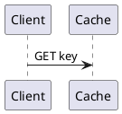

# Authoring figures, diagrams, captions & sizing

Conventions for embedding visuals in posts. All of them share one presentation
path: a centered `<figure>` with an optional caption, responsive sizing, and
(for raster/SVG images) click-to-zoom.

## Captions — one rule for everything

Put an **italic line immediately under** the image or diagram (no blank line
between them). It becomes a rich `<figcaption>` — inline `code`, **bold**,
*emphasis*, and [links](https://example.com) are all preserved.

```md

*Figure 1: what `this` shows — details, see [docs](https://example.com).*
```

Leave the italic line off if you don't want a caption.

## Sizing — optional, via the image title

Add a size keyword as the Markdown image **title** (the quoted string). Default
(omitted) is the image's natural width, capped at the post column. All are
centered and responsive (full width on mobile).

| Keyword | Width |
|---|---|
| `small`  | 38% of the column |
| `medium` | 62% |
| `large`  | 100% (full column) |

```md

*Optional caption*
```

## Images

Just standard Markdown images. They're wrapped in a centered `figure`, captioned
(if an italic line follows), sizable (title keyword), and zoomable on click.

## Diagrams as code — PlantUML & D2

Fenced ` ```plantuml ` and ` ```d2 ` blocks render to an **inline SVG at build**
via Kroki, cached in `diagram-cache/` (committed, so builds don't re-hit Kroki).
Both default to 50% width, centered; fence keywords `small` (33%) / `big` (100%)
adjust size, and an italic line right after the block is the caption.

**PlantUML** — themeable monochrome line-art (recolors with light/dark):

````md

*Caption on the italic line right after the block.*
````

**D2** — hand-drawn **sketch** style with color (Excalidraw-like), editable right
here in the markdown. It sits on a light card so it reads on the dark theme. Set
`style.fill` for colors; use `big` for detailed diagrams.

````md
```d2 big
direction: down
client: Client {shape: person}
primary: Primary {shape: cylinder; style.fill: "#4263eb"; style.font-color: "#fff"}
client -> primary: writes
primary -> client: acks
```
*Caption*
````

Add more Kroki languages later by extending `LANGS` in `src/lib/remark-kroki.mjs`.

## Excalidraw scenes (alternative)

Prefer **D2** (above) for hand-drawn diagrams you edit in the markdown. Use real
Excalidraw only when you want its exact look/tooling — as an external file:

1. Draw at <https://excalidraw.com>.
2. **Export → SVG** with **"Embed scene"** ✅ and **"Background"** ✅ enabled.
3. Commit the `.svg` under `public/images/…` and reference it like any image:

```md

*Caption*
```

To edit later: open the `.svg` back in <https://excalidraw.com> (it restores the
embedded scene), edit, and re-export.

## Animations (deferred)

Motion Canvas is deferred (pre-rendered video doesn't scale well across many
posts). When a real need arises, prefer **Lottie** or **CSS/SVG** animation for
lightweight/scalable cases, and reserve **Motion Canvas → video** for the
occasional rich, one-off explainer.
