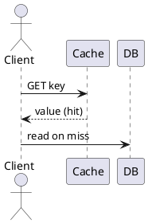

# Diagrams-as-code (PlantUML via Kroki) — Implementation Plan

> **For agentic workers:** REQUIRED SUB-SKILL: superpowers:executing-plans (inline). Steps use `- [ ]`.

**Goal:** Author a ` ```plantuml ` fenced block in a `.md` post and get a themeable inline SVG at build (no client JS), rendered via Kroki, cached (committed) so builds don't depend on Kroki after first render.

**Architecture:** Async **remark** plugin transforms `code[lang=plantuml]` mdast nodes → `html` nodes containing `<figure class="diagram">…svg…</figure>`, before expressive-code's rehype pass. SVG fetched from `KROKI_URL` (default https://kroki.io) via POST, monochrome+transparent skin injected, colors rewritten to `currentColor`, cached in committed `diagram-cache/<sha256>.svg`.

**Tech:** Node 20 global `fetch`; hand-rolled mdast walk (no `unist-util-visit` dep); Playwright e2e.

## Global Constraints
- No new runtime deps. No client JS for diagrams. `.md` posts only (raw-HTML passthrough).
- `KROKI_URL` env, default `https://kroki.io`. Cache dir `diagram-cache/` committed (NOT gitignored).
- Fail the build on Kroki error with no cache. Commit per task; push once at end (Task 3) after user OK.

## File Structure
- Create: `src/lib/remark-plantuml.mjs` — the plugin (fetch + cache + theme + node replace).
- Modify: `astro.config.mjs` — add to `markdown.remarkPlugins`.
- Modify: `src/styles/global.css` — `.diagram` rules.
- Modify: `src/content/posts/distributed-cache-series-part-1-redis.md` — one demo diagram.
- Create: `tests/diagrams.spec.ts` — e2e.
- Create: `diagram-cache/.gitkeep` (+ generated `*.svg`, committed).

---

### Task 1: remark-plantuml plugin + wiring + demo diagram

**Files:** create `src/lib/remark-plantuml.mjs`; modify `astro.config.mjs`, `src/styles/global.css`, the demo post; create `tests/diagrams.spec.ts`.

- [ ] **Step 1: Add the demo diagram** to `distributed-cache-series-part-1-redis.md` (near the top, after intro), so the e2e has a target:
````

````

- [ ] **Step 2: Write the failing e2e** `tests/diagrams.spec.ts`:
```ts
import { test, expect } from '@playwright/test';
test('plantuml block renders as an inline themeable SVG (no code block)', async ({ page }) => {
  await page.goto('/posts/distributed-cache-series-part-1-redis/');
  const fig = page.locator('figure.diagram');
  await expect(fig).toBeVisible();
  await expect(fig.locator('svg')).toBeVisible();
  // themed: uses currentColor, not baked black/white
  const html = await fig.innerHTML();
  expect(html).toContain('currentColor');
  // no raw plantuml code block leaked through expressive-code
  await expect(page.locator('code.language-plantuml, pre .language-plantuml')).toHaveCount(0);
  await expect(page.getByText('@startuml')).toHaveCount(0);
});
```

- [ ] **Step 3: Run it, verify RED** — `pnpm exec playwright test tests/diagrams.spec.ts` → FAIL (renders as a code block, no `figure.diagram`).

- [ ] **Step 4: Implement `src/lib/remark-plantuml.mjs`:**
```js
import { createHash } from 'node:crypto';
import fs from 'node:fs';
import path from 'node:path';

const KROKI_URL = (process.env.KROKI_URL || 'https://kroki.io').replace(/\/$/, '');
const CACHE_DIR = path.join(process.cwd(), 'diagram-cache');
const SKIN = [
  'skinparam backgroundColor transparent',
  'skinparam monochrome true',
  'skinparam shadowing false',
  'skinparam defaultFontName sans-serif',
].join('\n');

// Rewrite Kroki's baked colors to inherit the site theme.
export function themeSvg(svg) {
  return svg
    .replace(/\s*background:\s*#?\w+;?/gi, '')            // drop svg style background
    .replace(/<rect[^>]*\bfill="#(?:fff(?:fff)?|FFFFFF)"[^>]*\/>/gi, '') // bg rect
    .replace(/(fill|stroke)="#000000"/gi, '$1="currentColor"')
    .replace(/(fill|stroke)="black"/gi, '$1="currentColor"');
}

async function renderKroki(source) {
  const res = await fetch(`${KROKI_URL}/plantuml/svg`, {
    method: 'POST',
    headers: { 'Content-Type': 'text/plain', Accept: 'image/svg+xml' },
    body: `${SKIN}\n${source}`,
  });
  if (!res.ok) {
    throw new Error(`[remark-plantuml] Kroki ${res.status}: ${await res.text()}\n--- diagram ---\n${source}`);
  }
  return themeSvg(await res.text());
}

function collect(node, out) {
  if (node.type === 'code' && node.lang === 'plantuml') out.push(node);
  if (node.children) for (const c of node.children) collect(c, out);
}

export default function remarkPlantuml() {
  return async (tree) => {
    const nodes = [];
    collect(tree, nodes);
    for (const node of nodes) {
      const hash = createHash('sha256').update(`${SKIN}\n${node.value}`).digest('hex');
      const file = path.join(CACHE_DIR, `${hash}.svg`);
      let svg;
      if (fs.existsSync(file)) svg = fs.readFileSync(file, 'utf8');
      else {
        svg = await renderKroki(node.value);
        fs.mkdirSync(CACHE_DIR, { recursive: true });
        fs.writeFileSync(file, svg);
      }
      node.type = 'html';
      node.value = `<figure class="diagram">${svg}</figure>`;
      delete node.lang; delete node.meta;
    }
  };
}
```

- [ ] **Step 5: Register** in `astro.config.mjs`: `import remarkPlantuml from './src/lib/remark-plantuml.mjs';` and set `remarkPlugins: [remarkMath, alert, remarkPlantuml]`.

- [ ] **Step 6: CSS** in `src/styles/global.css`:
```css
.diagram{margin:26px 0;text-align:center;color:var(--text)}
.diagram svg{max-width:100%;height:auto}
```

- [ ] **Step 7: Run it, verify GREEN** — `pnpm exec playwright test tests/diagrams.spec.ts` → PASS. If `currentColor` assertion fails, inspect the real monochrome SVG (`curl` with SKIN) and adjust `themeSvg` regex, re-run.

- [ ] **Step 8: Commit** (include the generated cached SVG):
```bash
git add src/lib/remark-plantuml.mjs astro.config.mjs src/styles/global.css \
  src/content/posts/distributed-cache-series-part-1-redis.md tests/diagrams.spec.ts diagram-cache
git commit -m "Diagrams: build-time PlantUML->inline SVG via Kroki (themeable, cached)"
```

---

### Task 2: verify caching + full build + suite

- [ ] **Step 1: Cache hit** — with the SVG now committed, run a build with Kroki disabled to prove no network dependency: `KROKI_URL=http://127.0.0.1:1 npx astro build` → BUILD OK (served from `diagram-cache/`). If it fails, caching is broken — fix before proceeding.
- [ ] **Step 2: Full prod build** (normal) + preview: `npx astro build && (astro preview --port 4321 &)`.
- [ ] **Step 3: Full e2e suite** on preview: `pnpm exec playwright test` → all green (diagrams + layout + theme + comments + smoke).
- [ ] **Step 4: Visual check** — screenshot the demo post at dark & light; confirm the diagram is legible and recolors with the theme.

---

### Task 3: ship

- [ ] **Step 1:** Final review of the diff.
- [ ] **Step 2:** `git push origin main` (after user OK).
- [ ] **Step 3:** Poll the Actions run for the pushed SHA until `success` (CI build will call Kroki only if a diagram isn't cached; ours is committed → no call).

## Self-Review
- Spec coverage: authoring ✓ (Task1 S1), Kroki POST + env ✓ (plugin), cache committed ✓ (S8/Task2), theming currentColor ✓ (themeSvg + CSS), fail-loud ✓ (renderKroki throw), expressive-code ordering ✓ (remark→html node), verify ✓ (Task2). Excalidraw/Motion Canvas out of scope ✓.
- Placeholders: none — full plugin + test code included.
- Consistency: `themeSvg` exported and used in `renderKroki`; cache key = `sha256(SKIN+source)` identical in plugin and matches the committed file name.
